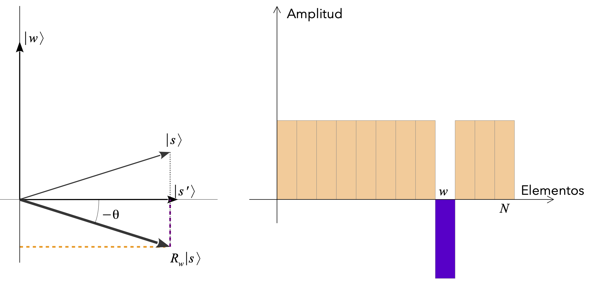

---
jupytext:
  text_representation:
    extension: .md
    format_name: myst
    format_version: 0.13
    jupytext_version: 1.16.1
kernelspec:
  display_name: Python 3 (ipykernel)
  language: python
  name: python3
license: CC-BY-4.0
github: https://github.com/jamasole/Curso-TalentQ-Jupyterlab
subject: Curso
venue: Quantum Spain
authors:
  - name: Javier Mas
    email: javier.mas@usc.es
    corresponding: true
    orcid: 0000-0001-7008-2126
    affiliations:
      - IGFAE-USC
  - name: David Castaño
    email: david.castano@uma.es
    corresponding: true
    orcid: 0000-0001-7008-2126
    affiliations:
      - UMA
math:   
    '\i': '{\color{blue} i}'
    '\bes': '\begin{equation*}'
    '\ees': '\end{equation*}'
    '\O': '{\mathcal O}'
    '\Lin': '\rm L'
    '\Hil': '{\mathcal H}'
    '\braa': '{\langle #1|}'
    '\ket': '{|#1\rangle}'
    '\braket': '{\langle #1|#2\rangle}'
    '\ketbra': '{|#1\rangle\langle #2|}'
    '\tr': '{\rm tr}'
    '\R': '{\mathbb R}' 
    '\C': '{\mathbb C}'
    '\V': '{\cal V}'
---
$\newcommand{\V}{{\cal V}}$
$\newcommand{\C}{{\mathbb C}}$
$\newcommand{\R}{{\mathbb R}}$
$\newcommand{\tr}{{\rm tr}}$
$\newcommand{\ketbra}[2]{{|#1\rangle\langle #2|}}$
$\newcommand{\braket}[2]{{\langle #1|#2\rangle}}$
$\newcommand{\ket}[1]{{|#1\rangle}}$
$\newcommand{\braa}[1]{{\langle #1|}}$
$\newcommand{\Hil}{{\mathcal H}}$
$\newcommand{\Lin}{\rm L}$
$\newcommand{\O}{{\mathcal O}}$
$\newcommand{\ees}{\end{equation*}}$
$\newcommand{\bes}{\begin{equation*}}$
$\newcommand{\i}{{\color{blue} i}}$

+++

```{figure} ../thumbnails/myThumbnail.png
:align: center
```

+++

# Algoritmo de Grover


```{code-cell} ipython3
---
slideshow:
  slide_type: slide
---
%run ../macro_tQ.py
```

+++ {"slideshow": {"slide_type": "slide"}}

<a id='aguja'></a>
<table width="100%">
    <td style="font-size:550%px;font-family:Helvetica;text-align:left;background-color:rgba(0,0,900, 0.3);">
<b> Una aguja en un pajar 2 </b>
</table>   

+++

::::{card} 
**Definición/Teorema/Lema**: *subtitulo del Teorema/lema/definición* 

^^^

Plantilla de Teorema, Lema o definición.
 
Debe de quedar una de las tres palabras del título: Definición, Teorema o Lema
   
La demostración/prueba/... es opcional. Puede borrarse todo el texto de a continuación, dejando el div del final!!! (la última linea)

    
:::{dropdown} Demostración/Prueba/...

TEXTO AQUÍ
    
:::
::::

Mas texto

+++

::::{admonition} Nota (Subtitulo de la nota) 
:class: note


     
Plantilla de Nota
    
El titulo debe de ser Nota
 
La demostración/prueba/... es opcional. Puede borrarse todo el texto de a continuación, dejando el div del final!!! (la última linea)

:::{dropdown} Demostración/Prueba/...

TEXTO AQUÍ
    
:::
::::

+++

::::{admonition} Ejercicio/Ejemplo (Subtitulo del ejercicio/ejemplo) 
:class: tip


        
Plantilla de Ejercicios y Ejemplos
     
Debe de quedar una de las dos palabras del título: Ejercicio o Ejemplo
 
La solución/pista/... es opcional. Puede borrarse todo el texto de a continuación, dejando el div del final!!! (la última linea)
 

:::{dropdown} Solución/Pista/...

TEXTO AQUÍ
    
:::
::::

+++

<a id='aguja_2'></a>
## Una aguja en un pajar

+++

::::{card} 
**Lema**:  
^^^
    
El cúbit $\ket{u}$  <i> más general</i> se puede representar, en la base computacional $\{\ket{0},\ket{1}\}$, usando dos números reales (ángulos) $\theta\in [0,\pi)$ y $\varphi\in [0,2\pi)$   


$$
|u\rangle = \cos{\frac{\theta}{2}}\, |0\rangle + e^{i\phi}\sin{\frac{\theta}{2}}\,|1\rangle 
$$

    
:::{dropdown} Demostración
Para demostrar el lema escribimos un vector de estado general usando la representación polar para las componentes complejas
    
$$
\begin{array}{rcl}
\ket{u} &=& u_0\ket{0} + u_1\ket{1} \\
&=& a_0 e^{i b_0}\ket{0} + a_1 e^{ib_1}\ket{1}\\
&=& e^{i b_0}\big(a_0 \ket{0} + a_1 e^{i(b_1-b_0)}\ket{1}\big)\\
&\sim & \big( a_0 \ket{0} + a_1 e^{i(b_1-b_0)}\ket{1} \big)
\end{array}
$$
    
donde hemos hecho uso de la irrelevancia de una fase global para descartar $e^{i b_0}$ en la última línea.

Ahora $a_1$ y $a_0$ no son números independientes sino que verifican $a_0^2 + a_1^2 = 0$ para que $\|\ket{u}\|=1$.
Esta ecuación se puede resolver en términos de un ángulo $\theta/2$ tal que
$$
a_0 = \cos\frac{\theta}{2}~~~,~~~ a_1 = \sin\frac{\theta}{2} 
$$
Por su parte, de los números $b_1, b_2$ sólo la diferencia
$$
\varphi = b_1-b_2
$$
es relevante para especificar $\ket{u}$.   
:::
::::

+++

::::{card} 
**Teorema**: *subtitulo del teorema* 
^^^
    
El cúbit $\ket{u}$  <i> más general</i> se puede representar, en la base computacional $\{\ket{0},\ket{1}\}$, usando dos números reales (ángulos) $\theta\in [0,\pi)$ y $\varphi\in [0,2\pi)$   


$$
|u\rangle = \cos{\frac{\theta}{2}}\, |0\rangle + e^{i\phi}\sin{\frac{\theta}{2}}\,|1\rangle 
$$

:::{dropdown} Demostración
Para demostrar el lema escribimos un vector de estado general usando la representación polar para las componentes complejas
    
$$
\begin{array}{rcl}
\ket{u} &=& u_0\ket{0} + u_1\ket{1} \\
&=& a_0 e^{i b_0}\ket{0} + a_1 e^{ib_1}\ket{1}\\
&=& e^{i b_0}\big(a_0 \ket{0} + a_1 e^{i(b_1-b_0)}\ket{1}\big)\\
&\sim & \big( a_0 \ket{0} + a_1 e^{i(b_1-b_0)}\ket{1} \big)
\end{array}
$$
    
donde hemos hecho uso de la irrelevancia de una fase global para descartar $e^{i b_0}$ en la última línea.

Ahora $a_1$ y $a_0$ no son números independientes sino que verifican $a_0^2 + a_1^2 = 0$ para que $\|\ket{u}\|=1$.
Esta ecuación se puede resolver en términos de un ángulo $\theta/2$ tal que
$$
a_0 = \cos\frac{\theta}{2}~~~,~~~ a_1 = \sin\frac{\theta}{2} 
$$
Por su parte, de los números $b_1, b_2$ sólo la diferencia
$$
\varphi = b_1-b_2
$$
es relevante para especificar $\ket{u}$.   
:::
::::

+++

::::{card} 
**Definición**:  
^^^
    
El cúbit $\ket{u}$  <i> más general</i> se puede representar, en la base computacional $\{\ket{0},\ket{1}\}$, usando dos números reales (ángulos) $\theta\in [0,\pi)$ y $\varphi\in [0,2\pi)$   


$$
|u\rangle = \cos{\frac{\theta}{2}}\, |0\rangle + e^{i\phi}\sin{\frac{\theta}{2}}\,|1\rangle 
$$

:::{dropdown} Demostración
Para demostrar el lema escribimos un vector de estado general usando la representación polar para las componentes complejas
    
$$
\begin{array}{rcl}
\ket{u} &=& u_0\ket{0} + u_1\ket{1} \\
&=& a_0 e^{i b_0}\ket{0} + a_1 e^{ib_1}\ket{1}\\
&=& e^{i b_0}\big(a_0 \ket{0} + a_1 e^{i(b_1-b_0)}\ket{1}\big)\\
&\sim & \big( a_0 \ket{0} + a_1 e^{i(b_1-b_0)}\ket{1} \big)
\end{array}
$$
    
donde hemos hecho uso de la irrelevancia de una fase global para descartar $e^{i b_0}$ en la última línea.

Ahora $a_1$ y $a_0$ no son números independientes sino que verifican $a_0^2 + a_1^2 = 0$ para que $\|\ket{u}\|=1$.
Esta ecuación se puede resolver en términos de un ángulo $\theta/2$ tal que
$$
a_0 = \cos\frac{\theta}{2}~~~,~~~ a_1 = \sin\frac{\theta}{2} 
$$
Por su parte, de los números $b_1, b_2$ sólo la diferencia
$$
\varphi = b_1-b_2
$$
es relevante para especificar $\ket{u}$.   
:::
::::

+++ {"slideshow": {"slide_type": "skip"}}

::::{admonition} Nota
:class: note


-  el ángulo disminuye con el tamaño $N$ de la base de datos. Este ángulo es la amplitud de probabilidad de encontrar la solución $w$ después de una medida de $\ket{s}$.
    
- Para $N\to \infty$ tenemos que $\theta \sim 1/\sqrt{N}$
::::

+++

::::{admonition} Nota (Subtitulo de la nota) 
:class: note


-  el ángulo disminuye con el tamaño $N$ de la base de datos. Este ángulo es la amplitud de probabilidad de encontrar la solución $w$ después de una medida de $\ket{s}$.
    
- Para $N\to \infty$ tenemos que $\theta \sim 1/\sqrt{N}$
::::

+++

::::{admonition} Ejercicio
:class: tip


Prueba esta igualdad   
::::

Mas texto

+++

::::{admonition} Ejercicio
:class: tip

prueba esta igualdad

:::{dropdown} Solución
Para demostrar el lema escribimos un vector de estado general usando la representación polar para las componentes complejas
    
TEXTO

:::
::::

+++

::::{card} 
**Lema**:  

^^^

Sea $\ket{\psi}$ un vector <i>preparable</i> en la forma  $\ket{\psi} = V\ket{0}$. El reflector paralelo a $\ket{\psi}$ es


$$
R_\psi = I - 2\ket{\psi}\bra{\psi} = V \left( I - 2\ket{0}\bra{0}\rule{0mm}{6mm} \right) V^\dagger = V R_0 V^\dagger
$$
::::

+++ {"slideshow": {"slide_type": "fragment"}}

 
 
 El algoritmos de Grover permite efectuar esta tarea en un número de pasos que crece como   ${\cal O}(\sqrt{N})$.

+++ {"slideshow": {"slide_type": "fragment"}}

::::{figure} ./figuras/Grover1.png
:width: 500px
:align: center
::::

+++

La estrategia se basa en iterar una serie de operaciones que amplifiquen la amplitud de obtener el estado $\ket{w}$.


Geométricamente, cada *iteración de Grover* es una composición de dos [*reflectores*](../00_Formalismo/01_Operadores.ipynb#reflect) $~
\fbox{$G = R_{s_\perp} R_w$}
~$, donde

$\boxed{G = R_{s_\perp} R_w}$


-  **el marcador**, $R_w$, produce una reflexión en la dirección *paralela* a  $\ket{w}$

$$
R_w\ket{s} ~=~ \left( I - 2\ket{w}\bra{w}\rule{0mm}{8mm}\right)\ket{s} ~ = ~ -\frac{1}{\sqrt{N}} \ket{w} + \sqrt{\frac{N-1}{N}} \ket{s^\prime}
$$

::::{figure} ./figuras/Grover1.png
:name: fig_ref_2
:width: 300px
:align: center
Pie de foto de la figura
::::


La estrategia se basa en iterar una serie de operaciones que amplifiquen la amplitud de obtener el estado $\ket{w}$.


Geométricamente, cada *iteración de Grover* es una composición de dos [*reflectores*](../00_Formalismo/01_Operadores.ipynb#reflect) $~
\fbox{$G = R_{s_\perp} R_w$}
~$, donde

$\boxed{G = R_{s_\perp} R_w}$


-  **el marcador**, $R_w$, produce una reflexión en la dirección *paralela* a  $\ket{w}$

$$
R_w\ket{s} ~=~ \left( I - 2\ket{w}\bra{w}\rule{0mm}{8mm}\right)\ket{s} ~ = ~ -\frac{1}{\sqrt{N}} \ket{w} + \sqrt{\frac{N-1}{N}} \ket{s^\prime}
$$

+++ {"slideshow": {"slide_type": "slide"}}

## Amplificación de amplitud

+++ {"slideshow": {"slide_type": "fragment"}}

La estrategia se basa en iterar una serie de operaciones que amplifiquen la amplitud de obtener el estado $\ket{w}$.


Geométricamente, cada *iteración de Grover* es una composición de dos [*reflectores*](../00_Formalismo/01_Operadores.ipynb#reflect) $~
\fbox{$G = R_{s_\perp} R_w$}
~$, donde

$\boxed{G = R_{s_\perp} R_w}$


-  **el marcador**, $R_w$, produce una reflexión en la dirección *paralela* a  $\ket{w}$

$$
R_w\ket{s} ~=~ \left( I - 2\ket{w}\bra{w}\rule{0mm}{8mm}\right)\ket{s} ~ = ~ -\frac{1}{\sqrt{N}} \ket{w} + \sqrt{\frac{N-1}{N}} \ket{s^\prime}
$$

+++ {"slideshow": {"slide_type": "fragment"}}

<center> 

</center>

+++

Referenciamos la [figura](#fig_ref)

+++ {"slideshow": {"slide_type": "slide"}}

::::{admonition} Nota
:class: note

$\bullet$
El marcador es la parte del algoritmo que <i>conoce</i> la solución. 
 
    Podemos formalizar el <i>marcador</i> como la <i>consulta al oráculo</i> $O_f$ asociado a una función que  <i>reconoce</i> la solución cuando la ve


\begin{equation}
f_w(x) = \left\{ \begin{array}{lcc}
             1 &   \hbox{si}  & x = w \\
              0 &  \hbox{si} & x \neq w \end{array}
   \right..
\end{equation}
    
$\bullet$  Al igual que cuando buscas una aguja en un pajar, saber cómo es una aguja no te ayuda a encontrarla,  si te encuentras con ella, reconocerla es una operacion de coste unidad. 


    
$\bullet$ La implementación de esta función es trivial porque sólo contiene un <i>min-term</i> $f_w(x=w)=1$. Podemos
    implementar esta función como un <i>oráculo de fase</i>, preparando la ancilla en el estado $\ket{-}$
$$
O_f \ket{x}\ket{-} = (-1)^{f_w(x)}\ket{x}\ket{-} ~= ~ \left\{ \begin{array}{lcc}
             -\ket{x}\ket{-} &   \hbox{si}  & x = w \\ \rule{0mm}{6mm}
              \, ~~\ket{x}\ket{-} &  \hbox{si} & x \neq w \end{array}
   \right..
$$

En resumen cada reflexión $U_w$ es equivalente a una consulta al oráculo.
    
</b>
::::

+++ {"slideshow": {"slide_type": "fragment"}}

- el vector resultante sufre una rotación de ángulo $2\theta$ en el  plano $\{\ket{w},\ket{s'}\}$. 


+++ {"slideshow": {"slide_type": "fragment"}}


- la amplitud del estado $\ket{w}$ aumenta a expensas de las amplitudes de los demás estados.

+++ {"slideshow": {"slide_type": "fragment"}}

- este hecho no depende de cómo sea $\ket{s}$, por tanto: es cierto *para cada iteración* $G$ de Grover.

:::{dropdown}  Demostración 
    
La demostración consiste en relacionar los vectores resultantes de aplicar el operador de Grover $k$  y $k-1$ veces
En general tendremos que 

$$
G^k\ket{s}  = a_k\ket{w} + b_k \ket{s^\prime}
$$

para ciertos coeficientes $a_k, b_k$. Ahora operamos

\begin{eqnarray}
G^k\ket{s} & = &a_k\ket{w} + b_k \ket{s^\prime} \\
&=& -U_sU_w\left(a_{k-1}\ket{w} + b_{k-1} \ket{s^\prime}\right) \\
&=& \left( 2 \ket{s}\bra{s} -I \right)\left(-a_{k-1}\ket{w} + b_{k-1}\ket{s^\prime}\right)\\
&=& \left(a_{k-1}\ket{w} - b_{k-1}\ket{s^\prime}\right) + 2\ket{s} \left(-a_{k-1}\braket{s}{w}+b_{k-1}\braket{s}{s^\prime}\right) \\
&=& a_{k-1}\ket{w} - b_{k-1}\ket{s^\prime} + 2\left(\frac{1}{\sqrt{N}}\ket{w} + \sqrt{\frac{N-1}{N}}\ket{s^\prime}\right) \left(-a_{k-1}\frac{1}{\sqrt{N}}+b_{k-1}\sqrt{\frac{N-1}{N}}\right) \\
&=&\left(a_{k-1} - \frac{2}{N} a_{k-1} + 2\frac{\sqrt{N-1}}{N}\right)\ket{w} + \left(b_{k-1} - 2\frac{\sqrt{N-1}}{N}a_{k-1} + 2\frac{N-1}{N}b_{k-1}\right)\ket{s^\prime}.
\end{eqnarray}
    
Agrupando términos, esta ecuación se puede escribir en forma matricial como

$$
\begin{bmatrix}
a_k\\
b_k
\end{bmatrix}
=
\begin{bmatrix}
\frac{N-2}{N} & 2\frac{\sqrt{N-1}}{N}\\
-2\frac{\sqrt{N-1}}{N} & \frac{N-2}{N}
\end{bmatrix}
\begin{bmatrix}
a_{k-1}\\
b_{k-1}
\end{bmatrix}.
$$
    
Es sencillo ver que esta matriz tiene determinante unidad, es decir, ha de ser una matriz de rotación
    
$$\text{det}(G)=\frac{\left(N-2\right)^2}{N^2} + 4\frac{N-1}{N^2} = \frac{N^2 - 4N + 4}{N^2} + \frac{4N-4}{N^2} = 1$$
    
Recordando
    
$$\sin{\theta} = \frac{1}{\sqrt{N}}~~~\Rightarrow ~~~\cos{\theta} = \sqrt{\frac{N-1}{N}} $$

$$\cos^2{\theta} - \sin^2{\theta} = \frac{N-2}{N} = \cos{2\theta}$$
    
$$2\sin{\theta}\cos{\theta} =2\frac{\sqrt{N-2}}{N}= \sin{2\theta}$$
    
se llega a
    
$$G=\begin{bmatrix}
\cos{2\theta} & \sin{2\theta}\\
-\sin{2\theta} & \cos{2\theta}
\end{bmatrix}$$

Esta es una matriz de rotación que gira un ángulo $2\theta$ en sentido antihorario. Es elementar comprobar que

$$
G^2  = \begin{bmatrix}
\cos{4\theta} & \sin{4\theta}\\
-\sin{4\theta} & \cos{4\theta} 
\end{bmatrix}
\hspace{1cm}... \hspace{1cm}
G^k = \begin{bmatrix}
\cos{2k\theta} & \sin{2k\theta}\\
-\sin{2k\theta} & \cos{2k\theta}
\end{bmatrix}
$$
:::

+++

:::{dropdown}  Demostración 
    
La demostración consiste en relacionar los vectores resultantes de aplicar el operador de Grover $k$  y $k-1$ veces
En general tendremos que 

$$
G^k\ket{s}  = a_k\ket{w} + b_k \ket{s^\prime}
$$

para ciertos coeficientes $a_k, b_k$. Ahora operamos

\begin{eqnarray}
G^k\ket{s} & = &a_k\ket{w} + b_k \ket{s^\prime} \\
&=& -U_sU_w\left(a_{k-1}\ket{w} + b_{k-1} \ket{s^\prime}\right) \\
&=& \left( 2 \ket{s}\bra{s} -I \right)\left(-a_{k-1}\ket{w} + b_{k-1}\ket{s^\prime}\right)\\
&=& \left(a_{k-1}\ket{w} - b_{k-1}\ket{s^\prime}\right) + 2\ket{s} \left(-a_{k-1}\braket{s}{w}+b_{k-1}\braket{s}{s^\prime}\right) \\
&=& a_{k-1}\ket{w} - b_{k-1}\ket{s^\prime} + 2\left(\frac{1}{\sqrt{N}}\ket{w} + \sqrt{\frac{N-1}{N}}\ket{s^\prime}\right) \left(-a_{k-1}\frac{1}{\sqrt{N}}+b_{k-1}\sqrt{\frac{N-1}{N}}\right) \\
&=&\left(a_{k-1} - \frac{2}{N} a_{k-1} + 2\frac{\sqrt{N-1}}{N}\right)\ket{w} + \left(b_{k-1} - 2\frac{\sqrt{N-1}}{N}a_{k-1} + 2\frac{N-1}{N}b_{k-1}\right)\ket{s^\prime}.
\end{eqnarray}
    
Agrupando términos, esta ecuación se puede escribir en forma matricial como

$$
\begin{bmatrix}
a_k\\
b_k
\end{bmatrix}
=
\begin{bmatrix}
\frac{N-2}{N} & 2\frac{\sqrt{N-1}}{N}\\
-2\frac{\sqrt{N-1}}{N} & \frac{N-2}{N}
\end{bmatrix}
\begin{bmatrix}
a_{k-1}\\
b_{k-1}
\end{bmatrix}.
$$
    
Es sencillo ver que esta matriz tiene determinante unidad, es decir, ha de ser una matriz de rotación
    
$$\text{det}(G)=\frac{\left(N-2\right)^2}{N^2} + 4\frac{N-1}{N^2} = \frac{N^2 - 4N + 4}{N^2} + \frac{4N-4}{N^2} = 1$$
    
Recordando
    
$$\sin{\theta} = \frac{1}{\sqrt{N}}~~~\Rightarrow ~~~\cos{\theta} = \sqrt{\frac{N-1}{N}} $$

$$\cos^2{\theta} - \sin^2{\theta} = \frac{N-2}{N} = \cos{2\theta}$$
    
$$2\sin{\theta}\cos{\theta} =2\frac{\sqrt{N-2}}{N}= \sin{2\theta}$$
    
se llega a
    
$$G=\begin{bmatrix}
\cos{2\theta} & \sin{2\theta}\\
-\sin{2\theta} & \cos{2\theta}
\end{bmatrix}$$

Esta es una matriz de rotación que gira un ángulo $2\theta$ en sentido antihorario. Es elementar comprobar que

$$
G^2  = \begin{bmatrix}
\cos{4\theta} & \sin{4\theta}\\
-\sin{4\theta} & \cos{4\theta} 
\end{bmatrix}
\hspace{1cm}... \hspace{1cm}
G^k = \begin{bmatrix}
\cos{2k\theta} & \sin{2k\theta}\\
-\sin{2k\theta} & \cos{2k\theta}
\end{bmatrix}
$$
:::

mas texto

+++ {"slideshow": {"slide_type": "slide"}}

## El circuito de Grover

La tarea ahora es crear sendos circuitos implementen las reflexiones $R_w$ y $R_s$.

Comenzaremos repasando la prescripción general para programar estos operadores.

+++ {"slideshow": {"slide_type": "fragment"}}

::::{card} 
**Lema**:  

^^^

Sea $\ket{\psi}$ un vector <i>preparable</i> en la forma  $\ket{\psi} = V\ket{0}$. El reflector paralelo a $\ket{\psi}$ es


$$
R_\psi = I - 2\ket{\psi}\bra{\psi} = V \left( I - 2\ket{0}\bra{0}\rule{0mm}{6mm} \right) V^\dagger = V R_0 V^\dagger
$$
::::

+++ {"slideshow": {"slide_type": "fragment"}}

De modo que sólo necesitamos un circuito para el reflector  $~R_0 = I- 2\ket{0}\bra{0}~$ *paralelo* al estado $\ket{0}$.


+++

## Cuadro mal escrito !!!!!!

+++ {"slideshow": {"slide_type": "slide"}}

::::{card} 
**Lema**:  
<p style="text-align: center;"> <p style="text-align: left ;color: navy;">  
^^^

El siguiente circuito  implementa la acción del  <i>reflector</i> $R_0$ paralelo al estado $\ket{0}$ es


$$~~R_0 ~=~ I- 2\ket{0}\bra{0} ~=~ \sum_{x\neq 0}\ket{x}\bra{x}-\ket{0}\bra{0}$$    


<center> 

</center>


donde la cadena $XZX$ puede situarse en cualquier cúbit, no necesariamente el último. 
::::

```{code-cell} ipython3
---
slideshow:
  slide_type: slide
---
from qiskit.circuit.library import ZGate
from qiskit import QuantumRegister, ClassicalRegister,QuantumCircuit

def R0(n):    
            
    qr = QuantumRegister(n)
    qc = QuantumCircuit(qr) 
    qc.x(n-1)
    qc.append(ZGate().control(n-1,ctrl_state= 0),qr)
    qc.x(n-1)
    qcR0 =  qc.to_gate()
    qcR0.name = 'R0'
    return qcR0
```

+++ {"slideshow": {"slide_type": "fragment"}}

Comenzando por $R_w$, se trata de  un operador que depende del vector desconocido $w$. Por tanto esa etiqueta debe figurar como un argumento oculto de la función que sirva para construir el operador $V(w)\ket{0} = \ket{w}$.

Simplemente es necesario añadir un operador $X$ por cada $1$ que haya en la versión binaria de $w$.

+++ {"slideshow": {"slide_type": "slide"}}

Con estos dos ingredientes ya podríamos fabricar el operador de Grover. 

$$
 G = D \, O = -R_s  R_w
$$

+++

::::{admonition} Notar
:class: note


¡no sabemos implementar  $-R_s$! $~$, sólo $R_s$. De modo que lo más cercano a la iteración de Grover que podemos conseguir es
$
\Rightarrow  R_s R_w = - G 
$

El signo menos, en apariencia es una fase global y no debería afectar a las probabilidades finales que son sus módulos al cuadrado. 
    
De modo que, de momento, lo vamos a ignorar, pero mantenemos una nota de atención sobre este hecho.
::::

+++

::::{figure} ./figuras/Grover5.png
:width: 60%
:align: center
::::

+++ {"slideshow": {"slide_type": "slide"}}

## La rotación óptima

+++ {"slideshow": {"slide_type": "fragment"}}

La iteración del circuito de Grover conduce a una sucesión de vectores

$$
G^k\ket{s} = \begin{bmatrix} \sin 2k\theta & \cos 2k \theta \\ - \cos 2k\theta & \sin 2k\theta \end{bmatrix} \begin{bmatrix}\sin\theta \\ \cos\theta \end{bmatrix} = \begin{bmatrix}\sin(2k+1)\theta  \\
\cos(2k+1)\theta \end{bmatrix}
$$
que giran *sin salirse* del plano $(\ket{w},\ket{s'})$

+++ {"slideshow": {"slide_type": "fragment"}}

::::{admonition} Ejercicio
:class: tip

prueba esta igualdad

:::{dropdown} Solución
Para demostrar el lema escribimos un vector de estado general usando la representación polar para las componentes complejas
    
$$
\begin{array}{rcl}
\ket{u} &=& u_0\ket{0} + u_1\ket{1} \\
&=& a_0 e^{i b_0}\ket{0} + a_1 e^{ib_1}\ket{1}\\
&=& e^{i b_0}\big(a_0 \ket{0} + a_1 e^{i(b_1-b_0)}\ket{1}\big)\\
&\sim & \big( a_0 \ket{0} + a_1 e^{i(b_1-b_0)}\ket{1} \big)
\end{array}
$$
    
donde hemos hecho uso de la irrelevancia de una fase global para descartar $e^{i b_0}$ en la última línea.

Ahora $a_1$ y $a_0$ no son números independientes sino que verifican $a_0^2 + a_1^2 = 0$ para que $\|\ket{u}\|=1$.
Esta ecuación se puede resolver en términos de un ángulo $\theta/2$ tal que
$$
a_0 = \cos\frac{\theta}{2}~~~,~~~ a_1 = \sin\frac{\theta}{2} 
$$
Por su parte, de los números $b_1, b_2$ sólo la diferencia
$$
\varphi = b_1-b_2
$$
es relevante para especificar $\ket{u}$.   
:::
    
::::

+++ {"slideshow": {"slide_type": "fragment"}}

- Pero es un número entero $ \Rightarrow $ el siguiente teorema da la **solución óptima**

+++ {"slideshow": {"slide_type": "slide"}}

::::{card} 
**Teorema**:  

^^^

el valor entero de $k\in{\mathbb Z}$ que maximiza la probabilidad $P_k = \sin^2((2k+1)\theta)$ de medir la solución $w$  es la parte entera 

    
$$
k_{op} = \left[ \frac{\pi}{4\theta} \right]
$$

 donde $\theta = \arcsin \sqrt{\frac{1}{N}}$.

Se cumple en este caso que:


$$
1 - \frac{1}{N} \leq P_{k_{op}} \leq 1\, .
$$
::::

+++ {"slideshow": {"slide_type": "fragment"}}

::::{admonition} Ejercicio
:class: tip

    
ejecuta el algoritmo de Grover variando el número <i>it</i> de iteraciones de Grover y verifica que el valor de $k$ óptimo es el enunciado en el teorema.
::::

+++ {"slideshow": {"slide_type": "slide"}}

Cuando $N\to \infty$, es decir, cuando nuestra base de datos es muy grande 
el vector inicial tiene un ángulo muy pequeño. 

$$
\theta = \arcsin \frac{1}{\sqrt{N}} \to \frac{1}{\sqrt{N}} - ....
$$

a orden más bajo en serie de potencias de $1/\sqrt{N}$

+++ {"slideshow": {"slide_type": "fragment"}}

::::{card} 
**Teorema**:  

^^^
máximamente a la solución crece como 


$$
k_{op} \approx \frac{\pi}{4}\sqrt{N}
$$
::::

+++ {"slideshow": {"slide_type": "fragment"}}

Esto supone un crecimiento $\mathcal{O}(\sqrt{N})$ en lugar de $\mathcal{O}(N)$ que es lo que esperaríamos clásicamente. 

+++ {"slideshow": {"slide_type": "slide"}}

<a id='agujas'></a>
<table width="100%">
    <td style="font-size:250%px;font-family:Helvetica;text-align:left;background-color:rgba(0,0,900, 0.3);">
<b> Varias agujas en un pajar </b>
</table>   

+++ {"slideshow": {"slide_type": "slide"}}

Un usuario podría tener más de una línea telefónica contratada. En ese caso, *varios* números de teléfono servirán para dar con *un sólo* nombre.

+++ {"slideshow": {"slide_type": "fragment"}}

Supondremos ahora que la búsqueda en la base de datos admite $M$ resultados satisfactorios distintos $w_1,....,w_M$.

+++ {"slideshow": {"slide_type": "fragment"}}

El vector inicial se puede descomponer en suma de sus componentes *a lo largo* de ${\cal B}$ y de ${\cal B}_\perp$


\begin{eqnarray}
\ket{s} = \frac{1}{\sqrt{N}} \sum_{x\in \Hil} \ket{x} 
&=&  \frac{1}{\sqrt{N}} \sum_{x\in {\cal B}} \ket{x}
 +  \frac{1}{\sqrt{N}} \sum_{x\in {\cal B}_\perp} \ket{x}
\\ \rule{0mm}{12mm}
&=&\sqrt{\frac{M}{N}}\ket{w} + \sqrt{\frac{N-M}{N}}\ket{s^\prime}.
\end{eqnarray}


+++ {"slideshow": {"slide_type": "fragment"}}

::::{card} 
**Teorema**:  

^^^


el valor entero de $k\in{\mathbb Z}$ que maximiza la probabilidad $P_k = \sin^2 ((2k+1)\theta)$ de medir la solución $w$  es la parte entera de $\pi/4\theta$

    
$$
k_{op} = \left[ \frac{\pi}{4\theta} \right]
$$

 donde $\theta = \arcsin \sqrt{\frac{M}{N}}.~$
En este caso, la probabilidad de medir el estado $\ket{w}$ es

$$
1 - \frac{M}{N} \leq P_{k_{op}} \leq 1 \, .
$$
::::

+++ {"slideshow": {"slide_type": "fragment"}}

en el límite $N\to \infty$ el coste computacional crece aun como la raíz cuadrada

::::{card} 
**Teorema**:  

^^^
máximamente a alguna de las soluciones $w_i$, crece como 


$$
k_{op} \approx \frac{\pi}{4}\sqrt{\frac{N}{M}}
$$
::::

+++ {"slideshow": {"slide_type": "fragment"}}

Vemos que el número de iteraciones que hay que realizar es menor. A cambio sólo obtendremos una solución $w_i$ después de cada ejecución.

+++ {"slideshow": {"slide_type": "fragment"}}

el único operador que necesitamos modificar es $R_w$

```{code-cell} ipython3
---
slideshow:
  slide_type: fragment
---
def Rw(n,w_array): #w_array es una lista de enteros w_i en S_n  
            
    qr = QuantumRegister(n)
    qc = QuantumCircuit(qr) 
    
    for w in w_array:
        wstring = format(int(w), 'b').zfill(n)
        for i,wi in enumerate(reversed(wstring)):
            if wi == '1':
                qc.x(qr[i])
        qc.append(R0(n),qr)        
        for i,wi in enumerate(reversed(wstring)):
            if wi == '1':
                qc.x(qr[i])
    qcRw =  qc.to_gate()
    qcRw.name='Rw'
    return qcRw
```

+++ {"slideshow": {"slide_type": "fragment"}}

Ahora podemos correr el mismo circuito con esta modificación


+++ {"slideshow": {"slide_type": "slide"}}

Primero debemos calcular el valor óptimo de iteraciones $k_{op} = [\pi/(4 \arcsin \sqrt{M/N})]$

```{code-cell} ipython3
---
slideshow:
  slide_type: fragment
---
# dimensión de la base de datos
n=4
# lista de soluciones ocultas
w_array = [1, 3, 6, 7, 15]

# valor de k óptimo
k_op = int(np.pi/(4*np.arcsin(np.sqrt(len(w_array)/2**n))))
print('k_op =',k_op)
```

+++ {"slideshow": {"slide_type": "fragment"}}

Ahora construimos el circuito de Grover con $k_{op}$ iteraciones. 

```{code-cell} ipython3
---
slideshow:
  slide_type: slide
---
# pasamos las soluciones a cadenas binarias de n entradas
wstring = [format(int(w), 'b').zfill(n) for w in w_array]
print('w_i =',wstring)

qr = QuantumRegister(n)
cr = ClassicalRegister(n)
qcGrover = QuantumCircuit(qr,cr)
qcGrover.h(qr)
qcGrover.barrier()

for i in range(k_op):
    qcGrover.append(G(n,w_array),qr)

qcGrover.barrier()

qcGrover.measure(qr,cr)
qcGrover.draw('mpl')
```

+++ {"slideshow": {"slide_type": "slide"}}

<a id='contcuan'></a>
<table width="100%">
    <td style="font-size:250%px;font-family:Helvetica;text-align:left;background-color:rgba(0,0,900, 0.3);">
<b> Contaje cuántico </b>
</table>   

+++ {"slideshow": {"slide_type": "slide"}}

En el algoritmos de Grover es crucial saber cuántas iteracions $k$ del operador $G$ hay que realizar. 

En el caso de múltiples soluciones, esto depende de $M$. 

$M$ es desconocido de antemano, por lo que el algoritmo ve *comprometida su eficiencia*. 

+++ {"slideshow": {"slide_type": "fragment"}}

En esta sección vamos a explicar **cómo deducir** $M$ como paso previo, invocando el algoritmo de Estimación de Fase Cuántica.

+++ {"slideshow": {"slide_type": "fragment"}}

Ya hemos visto que, en la base $\{|\omega\rangle, |s'\rangle\}$, podemos escribir la iteración de Grover como la matriz de rotación

$$
G =
\begin{bmatrix}
\cos2\theta & \sin2\theta\\
-\sin2\theta & \cos2\theta
\end{bmatrix},
$$

donde 

$$
\theta = \arcsin M/N 
$$

+++ {"slideshow": {"slide_type": "slide"}}

Conocer el valor de $\theta$ nos permitiría tener acceso al valor de $$ M  = N\sin\theta 
$$

+++ {"slideshow": {"slide_type": "fragment"}}


Los  autovalores  y autoestados  de este operador son los siguientes

$$
 \left(e^{+ 2i\theta}, \begin{bmatrix}- i \\1 \end{bmatrix}\right)~~~~,~~~~ \left( e^{- 2i\theta}, \begin{bmatrix}+ i \\1 \end{bmatrix} \right)
$$ 

que están pidiendo *a gritos* el algoritmo QPE, de estimación cuántica de fase.

+++ {"slideshow": {"slide_type": "fragment"}}

::::{admonition} Ejercicio
:class: tip

prueba este resultado
::::

+++

::::{card} 
**Lema**:  

^^^

Sea $\ket{\psi}$ un vector <i>preparable</i> en la forma  $\ket{\psi} = V\ket{0}$. El reflector paralelo a $\ket{\psi}$ es


$$
R_\psi = I - 2\ket{\psi}\bra{\psi} = V \left( I - 2\ket{0}\bra{0}\rule{0mm}{6mm} \right) V^\dagger = V R_0 V^\dagger
$$
::::

+++

::::{admonition} Ejercicio
:class: tip

Prueba esta igualdad

:::{dropdown} Solución
Para demostrar el lema escribimos un vector de estado general usando la representación polar para las componentes complejas
    
TEXTO
:::
::::
